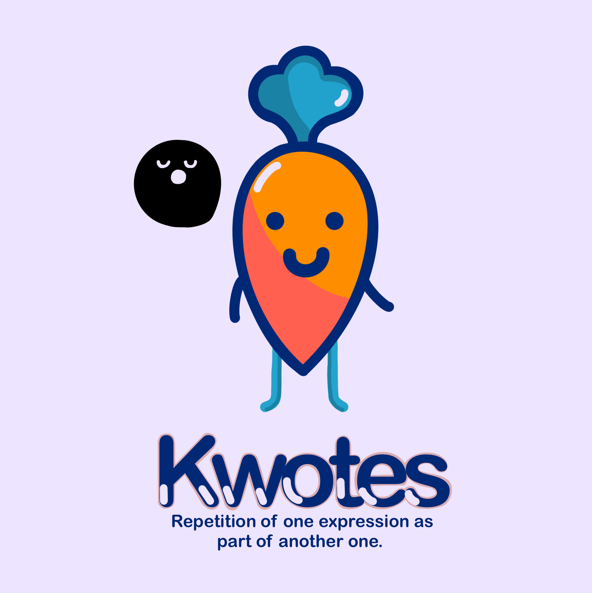
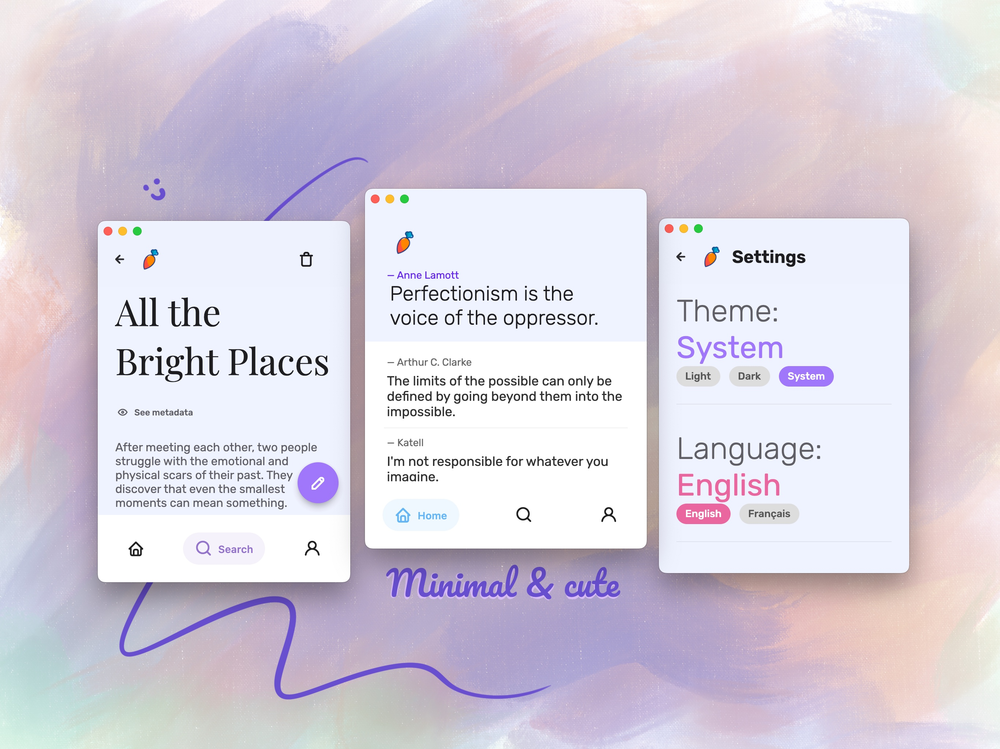
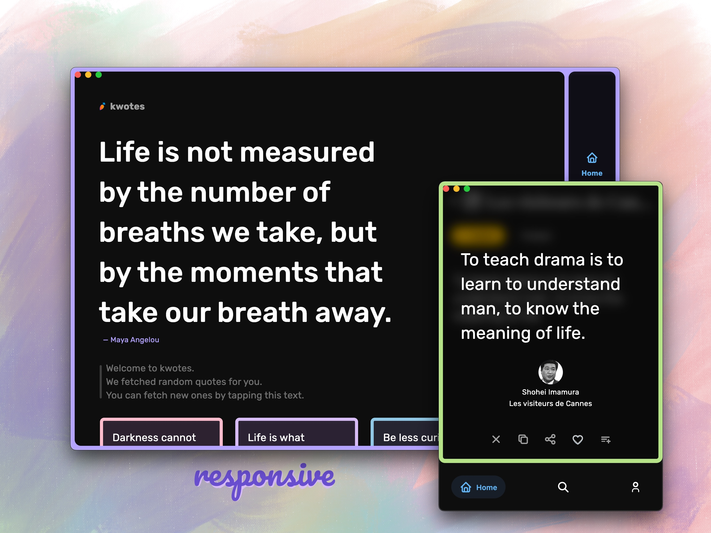
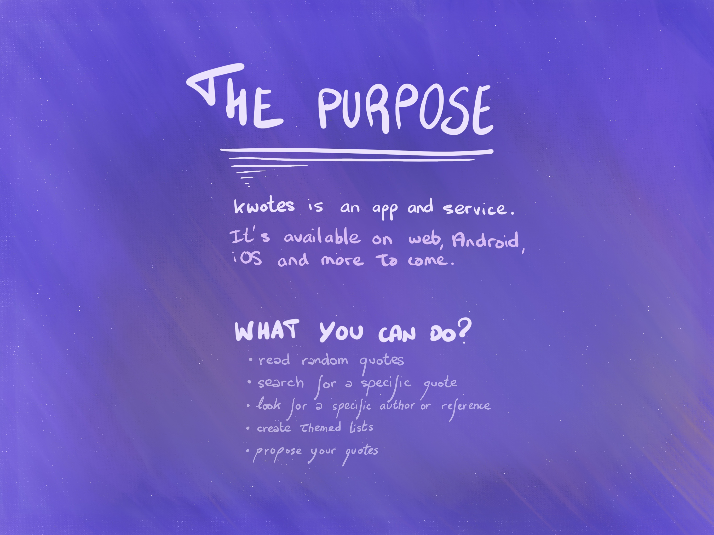
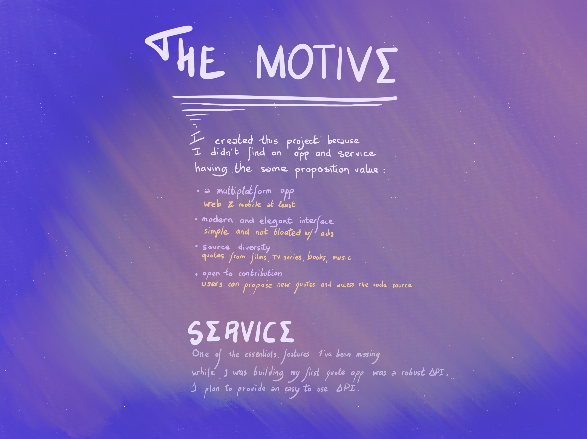

<p align="middle">
  
</p>

# Status


[](https://codemagic.io/apps/5fd420c277de1a00167ebea4/5fd420c277de1a00167ebea3/latest_build)

# Download

<span style="margin-right: 10px;">
  <a href="https://apps.apple.com/us/app/out-of-context/id1516117110?ls=1">
    
  </a>
</span>

<span style="margin-right: 10px;">
  <a href="https://play.google.com/store/apps/details?id=com.outofcontext.app">
    
  </a>
</span>

<span>
  <a href="https://kwotes.fr">
    
  </a>
</span>
<br>
<br>
<br>

<p align="middle">
  
</p>

<p align="middle">
  
</p>

# Table of Contents

- [Status](#status)
- [Download](#download)
- [Table of Contents](#table-of-contents)
- [The Purpose](#the-purpose)
  - [What you can do?](#what-you-can-do)
- [The motive](#the-motive)
  - [Service](#service)
- [My main sources](#my-main-sources)
- [Contribute](#contribute)
- [Credits](#credits)
  - [General Purpose](#general-purpose)
  - [Libraries](#libraries)
- [Add a quote](#add-a-quote)
  - [Basic rules](#basic-rules)
  - [Tips](#tips)
  - [Avoid](#avoid)
- [Contribute](#contribute-1)
    - [PLEASE READ](#please-read)
  - [Code styles](#code-styles)
    - [Dart class](#dart-class)
- [License](#license)
- [Privacy Policy](#privacy-policy)


<br /><br />
# The Purpose

<p align="left">
  
</p>

<details>
<summary>Text only version of <i>the purpose</i> image</summary>

[**kwotes**](https://kwotes.fr) is an app and service.<br/>
It's available on web, Android, iOS & more to come.

## What you can do?

* Read random quotes
* Search for a specific quote
* Look for paticular author or reference
* Create themed quote lists
* Propose your own quotes
* Support multi-language (english, french for now)

</details>

<br /><br />
# The motive

<p align="left">
  
</p>

<details>
<summary>Text only version of <i>the motive</i> image</summary>

I created this project because first of all I love quotes,
then I didn't find an app or service having the same proposition value of kwotes, including:

* <b>A multiplatform app</b><br /> <span style="margin-right: 10px;">web & mobile at least</span>
* <b>Modern & elegant interface</b><br />simple and not bloated with ads
* <b>Source diversity</b><br />quotes from films, tv series, books, musics , ...
* <b>Open to contribution</b><br />users can propose new quotes and access application code bade.

## Service

_kwotes as a service_ will propose a public API to fetch quotes from the database.
It's one of the goals of this project in a long-term scenario. The API will probably have a free & paid tier.

</details>

# My main sources

I take most of my quotes in movies, tv series, books & music.
Those sources are very different from each other and it's something I really appreciate.
I wouldn't like to limit the fun to only books.

Don't limit yourself neither in the form of sources.
Culture is very vast and rich. We don't have to stay in one medium.

# Contribute

This project welcomes contributions whatever its size.
You can participate in different ways: 

* Give your general feedback & suggestion
* Submit new quotes in the app
* Report a bug in the app

You cannot run this app on you local environment yet.
I'll have to clone the firebase backend into a test project for security reasons.

# Credits

These projecs and libraries condierably helped kwotes.

## General Purpose


| Name                                     | Description                        |
| ---------------------------------------- | ---------------------------------- |
| [Flutter](https://flutter.dev)           | Frontend UI library.               |
| [Dart](https://dart.dev)                 | Programming language.              |
| [GitHub](https://github.com)             | Source code repository.            |
| [VSCode](https://code.visualstudio.com/) | Code editor                        |
| [Firebase](https://firebase.google.com/) | Cloud database & backend services. |
| [Codium](https://vscodium.com/)          | AI code assistant.                 |


## Libraries

| Name                                                                              | Description                                                                                                                                                                                                                                            |
| --------------------------------------------------------------------------------- | ------------------------------------------------------------------------------------------------------------------------------------------------------------------------------------------------------------------------------------------------------ |
| [adaptive_theme](https://pub.dev/packages/adaptive_theme)                         | Theme manager.                                                                                                                                                                                                                                         |
| [algolia](https://pub.dev/packages/algolia)                                       | Search service.                                                                                                                                                                                                                                        |
| [animated_text_kit](https://pub.dev/packages/animated_text_kit)                   | Text animation.                                                                                                                                                                                                                                        |
| [beamer](https://pub.dev/packages/beamer)                                         | A litte less complex router (than the native one).                                                                                                                                                                                                     |
| [bottom_sheet](https://pub.dev/packages/bottom_sheet)                             | Custom bottom sheet widget that can be resized in response to drag gestures and then scrolled.                                                                                                                                                         |
| [boxy](https://pub.dev/packages/boxy)                                             | Additional & flexible layout widgets.                                                                                                                                                                                                                  |
| [cupertino_icons](https://pub.dev/packages/cupertino_icons)                       | Icons from Apple.                                                                                                                                                                                                                                      |
| [cloud_firestore](https://pub.dev/packages/cloud_firestore)                       | Firestore database to access & store quote data.                                                                                                                                                                                                       |
| [cloud_functions](https://pub.dev/packages/cloud_functions)                       | Cloud functions for server-side code.                                                                                                                                                                                                                  |
| [dismissble_page](https://pub.dev/packages/dismissble_page)                       | Widget page implementing swipe-to-dismiss gesture.                                                                                                                                                                                                     |
| [easy_localization](https://pub.dev/packages/easy_localization)                   | Internationalization for Flutter applications.                                                                                                                                                                                                         |
| [file_picker](https://pub.dev/packages/file_picker)                               | File picker for selecting folder to save quote images.                                                                                                                                                                                                 |
| [firebase_auth](https://pub.dev/packages/firebase_auth)                           | Firebase authentication for signing in users.                                                                                                                                                                                                          |
| [firebase_analytics](https://pub.dev/packages/firebase_analytics)                 | Firebase analytics for tracking app usage.                                                                                                                                                                                                             |
| [firebase_core](https://pub.dev/packages/firebase_core)                           | Firebase core for initializing Firebase services.                                                                                                                                                                                                      |
| [firebase_storage](https://pub.dev/packages/firebase_storage)                     | Firebase storage for accessing static images.                                                                                                                                                                                                          |
| [flex_list](https://pub.dev/packages/flex_list)                                   | Puts as many provided elements as possible in one row (like Wrap), but also extends the width of the elements by the remaining space per row.                                                                                                          |
| [flutter_animate](https://pub.dev/packages/flutter_animate)                       | A performant library that makes it simple to add almost any kind of animated effect in Flutter.                                                                                                                                                        |
| [flutter_dotenv](https://pub.dev/packages/flutter_dotenv)                         | Load configuration at runtime from a .env file which can be used throughout the application.                                                                                                                                                           |
| [flutter_improved_scrolling](https://pub.dev/packages/flutter_improved_scrolling) | An attempt to implement better scrolling for Flutter Web and Desktop. Includes keyboard, MButton and custom mouse wheel scrolling.                                                                                                                     |
| [flutter_langdetect](https://pub.dev/packages/flutter_langdetect)                 | A Flutter package for language detection, ported from the Python langdetect library.                                                                                                                                                                   |
| [flutter_launcher_icons](https://pub.dev/packages/flutter_launcher_icons)         | A command-line tool which simplifies the task of updating your Flutter app's launcher icon.                                                                                                                                                            |
| [flutter_loggy](https://pub.dev/packages/flutter_loggy)                           | Loggy extention for Flutter. Loggy is an highly customizable logger for dart that uses mixins to show all the needed info.                                                                                                                             |
| [flutter_solidart](https://pub.dev/packages/flutter_solidart)                     | A simple state-management library inspired by SolidJS.                                                                                                                                                                                                 |
| [flutter_tabler_icons](https://pub.dev/packages/flutter_tabler_icons)             | Tabler icons for Flutter.                                                                                                                                                                                                                              |
| [glutton](https://pub.dev/packages/glutton)                                       | Simple multiplatform local data storage.                                                                                                                                                                                                               |
| [google_fonts](https://pub.dev/packages/google_fonts)                             | Google fonts for Flutter.                                                                                                                                                                                                                              |
| [image_downloader_web](https://pub.dev/packages/image_downloader_web)             | Simply download images on web. Web implementation of image_downloader.                                                                                                                                                                                 |
| [infinite_carousel](https://pub.dev/packages/infinite_carousel)                   | Infinite Carousel is a flutter carousel widget that supports infinite looping and gives precise control over selected item anchor and carousel scroll velocity.                                                                                        |
| [jiffy](https://pub.dev/packages/jiffy)                                           | Display relative date & time. Date parser & formatter.                                                                                                                                                                                                 |
| [just_the_tooltip](https://pub.dev/packages/just_the_tooltip)                     | Customizable tooltip.                                                                                                                                                                                                                                  |
| [liquid_pull_to_refresh](https://pub.dev/packages/liquid_pull_to_refresh)         | A beautiful and custom refresh indicator for flutter.                                                                                                                                                                                                  |
| [loggy](https://pub.dev/packages/loggy)                                           | Highly customizable logger for dart that uses mixins to show all the needed info.                                                                                                                                                                      |
| [lottie](https://pub.dev/packages/lottie)                                         | Lottie is a mobile library for Android and iOS that parses Adobe After Effects animations exported as json with Bodymovin and renders them natively on mobile! This repository is an unofficial conversion of the Lottie-android library in pure Dart. |
| [photo_view](https://pub.dev/packages/photo_view)                                 | A simple zoomable image/content widget for Flutter.                                                                                                                                                                                                    |
| [rive](https://pub.dev/packages/rive)                                             | Real-time interactive design and animation tool.                                                                                                                                                                                                       |
| [salomon_bottom_bar](https://pub.dev/packages/salomon_bottom_bar)                 | A beautiful bottom navigation bar.                                                                                                                                                                                                                     |
| [screenshot](https://pub.dev/packages/screenshot)                                 | Capture widgets as images. Even if there're not rendered on screen.                                                                                                                                                                                    |
| [share_plus](https://pub.dev/packages/share_plus)                                 | A Flutter plugin to share content from your Flutter app via the platform's share dialog.                                                                                                                                                               |
| [smooth_page_indicator](https://pub.dev/packages/smooth_page_indicator)           | Customzable animated page indicator with a set of built-in effects.                                                                                                                                                                                    |
| [super_context_menu](https://pub.dev/packages/super_context_menu)                 | Single context menu widget that works accross all desktop platforms, mobile platforms and web.                                                                                                                                                         |
| [text_wrap_auto_size](https://pub.dev/packages/text_wrap_auto_size)               | Wraps text and auto sizes it with respect to the given dimensions, including style, text properties and correct hyphenation. Result can be accessed programmatically.                                                                                  |
| [url_launcher](https://pub.dev/packages/url_launcher)                             | Open URLs in browser.                                                                                                                                                                                                                                  |
| [verbal_expression](https://pub.dev/packages/verbal_expression)                   | Regular expressions made easy.                                                                                                                                                                                                                         |
| [window_manager](https://pub.dev/packages/window_manager)                         | Customize, resize & reposition desktop app window.                                                                                                                                                                                                     |

# Add a quote

You can freely add a quote to the app after creating an account.

## Basic rules

The service is manually handled and is not an automated process, so a human will read and validate your quote if it respect some basic rules:

* Your quote should be short (1 sentence or 2); it's not a poem.
* It must be easily understandable
* It should sparkle an emotion or welcome a reflexion
* Avoid offensive words of ideas (e.g. racism, sexism)

These validation criterias are completely subjective.

## Tips

We can't assure you than every submission will be accepted but you can improve your chances with these tips:

* Check the grammar, sentences' structure and ponctuation 
  <br/>A quote with a lot of mistakes is more likely to be rejected
* Provide a valid author 
  <br/>And if this author doesn't already exist in the database, give a good amount of information
* Give a valid reference 
  <br/>And if this reference doesn't already exist in the database, give a good amount of information
* Correctly categorize the quote with available topics (necessary)

## Avoid 

On the contrary, a short list of usual rejections:

* Hard to understand due to missing or partial information
* Strong language, offensive words or ideas
* Too ordinary (the sentence doesn't have any particularity - e.g.: _The sun is red._)

If you still have doubts, you can always open an issue here.

> Whenever you're down, look up. It'll make your realize just how big and beautiful the world is.<br/> — **Emma Green** — Away

# Contribute

### PLEASE READ

> ⚠️ This project is in early development stage so the developer part hasn't been built yet. You won't be able to contribute at the moment without explicit authorization.

## Code styles

Repository code styles for better structure and reading.

### Dart class

Rules for dart classes.

* All imports at the top, ascending ordered alphabeticaly
* Variables declared at the top of the state

```dart
class _DashboardState extends State<Dashboard> {
  User userAuth;
  bool canManage = false;
  // ...
}
```

Class methods in priority order:
* Overrides (e.g. `initState`)
* build method
* Custom methods which return a widget
* Other functions (e.g. auth functions, fetch data, ...)

# License

Mozilla Public License 2.0.

Please read the [LICENSE](./LICENSE) for more information.

Please open a pull request if you have any doubt.

# Privacy Policy

You can find the platform's privacy policy in this repo: [TOS.md](https://github.com/rootasjey/kwotes/blob/master/TOS.md)