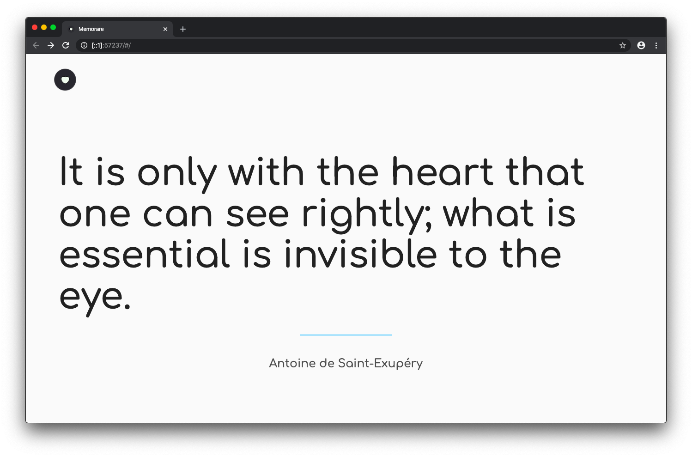
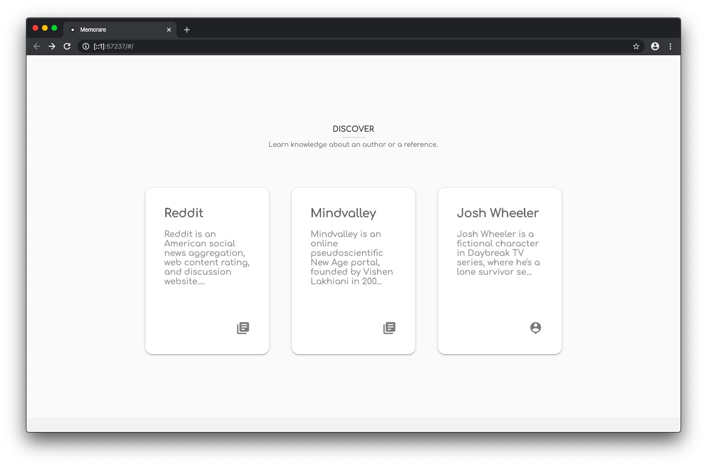
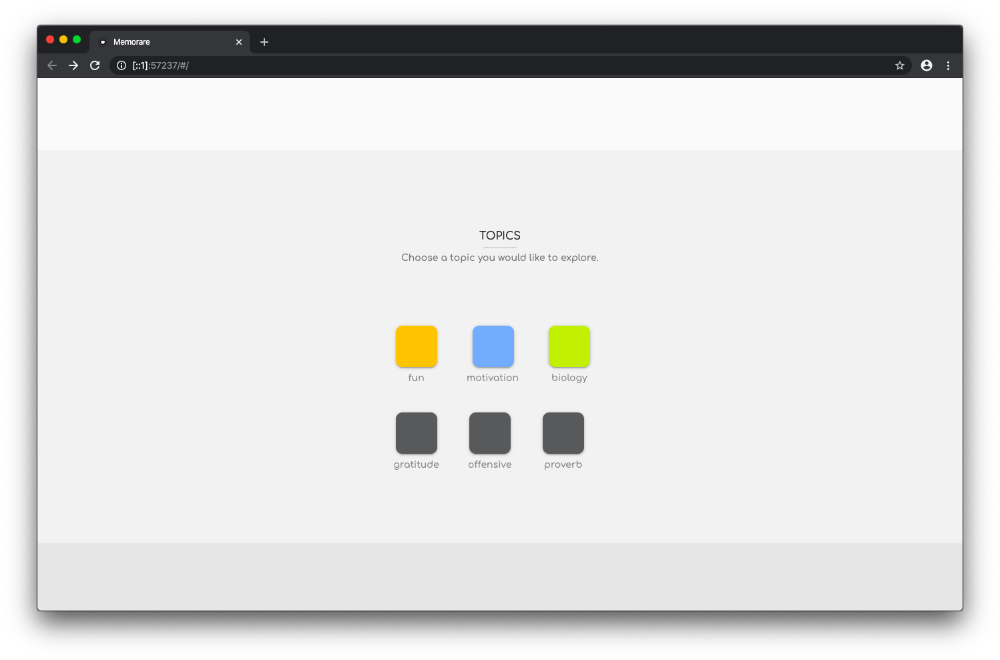
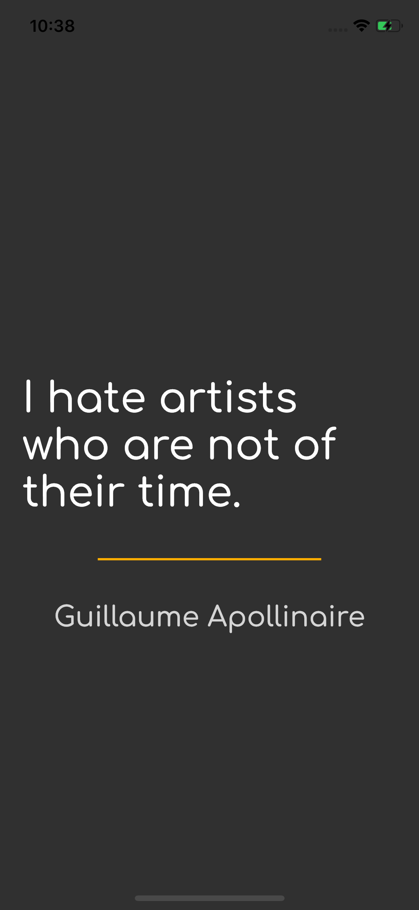
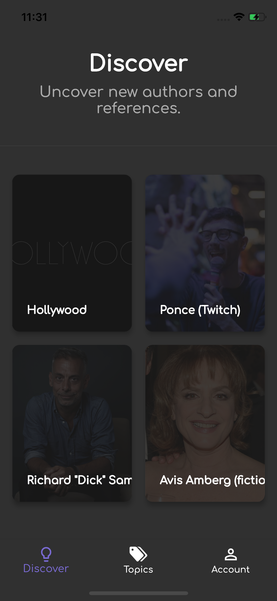
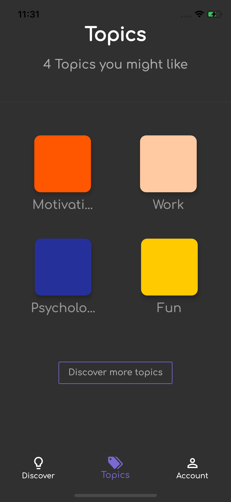

<p align="middle">
  
</p>

<h1 align="middle">Out Of Context</h1>

<p align="middle">Outside the frame</p>

<p align="middle">
  
</p>

# Quickstart

> ⚠️ This project is in early development stage so you may find bugs. The developer part hasn't been built yet, so you won't be able to contribute to it at the moment without explicit authorization.

## Pre-requisites

Make sure you have Flutter dev tools installed.
You can test that by running the following command in a terminal:

```bash
flutter doctor -v
```

This will check that everything is alright.

If you don't have the flutter dev tools yet, please visit the [official Flutter page](https://flutter.dev).

## Setup the project

1. Clone the project

```bash
git clone https://github.com/memorare/mobile.git
```

2. Fill up the file `lib/app_keys.json` with your url and your private key:

> You can find them at [dev.outofcontext.app](https://dev.outofcontext.app)

```dart
/// Will be available soon
```

* Run the app using Android Studio, VSCode or the Command line interface

```bash
flutter run lib/main.dart
```

# Contibute

You won't be able to contribute to this project at the moment without explicit authorization due to the early development stage and the missing developers section.

## Code styles

Repository code styles for better structure and reading.

### Dart class

Rules for dart classes.

* All imports at the top, ascending ordered alphabeticaly
* Variables declared at the top of the state

```dart
class _DashboardState extends State<Dashboard> {
  FirebaseUser userAuth;
  bool canManage = false;
  // ...
```

* Class methods in priority order:
  * Overrides (e.g. `initState`)
  * build method
  * Custom methods which return a widget
  * Other functions (e.g. auth functions, fetch data, ...)

# Licence

Mozilla Public License 2.0.

Please read the [LICENSE](./LICENSE) for more information.

Please [ask](mailto:github@outofcontext.app) if you have any doubt.

# Screenshots

## Web

--------------------------------

--------------------------------

--------------------------------

--------------------------------

## Mobile

| Quotidian | Discover | Topics |
| :---------: | :------: | :---------: |
|  |  |   |
